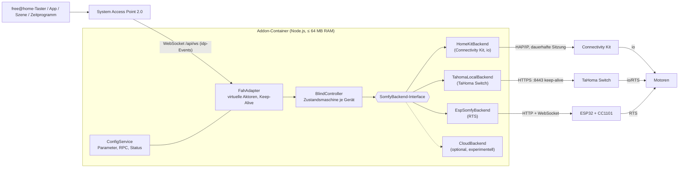

# Analyse: Somfy-Rollläden/Jalousien in free@home per Addon

Stand: 23.09.2026 · Zielsystem: Busch-Jaeger/ABB free@home **System Access Point 2.0** + **Somfy Connectivity Kit**

---

## 1. Kurzfassung

| # | Erkenntnis | Folge |
|---|---|---|
| 1 | **Das Connectivity Kit hat keine lokale API (mehr).** Somfy hat den *TaHoma Developer Mode* im Oktober 2025 auf dem Kit abgeschaltet und schließt das Kit in der offiziellen Doku ausdrücklich aus. | Der übliche Weg (lokale REST-API wie bei der TaHoma Switch) ist mit dem Kit **nicht** möglich. |
| 2 | **Cloud-Zugang ist inoffiziell und wackelig.** Die Somfy-/Overkiz-Cloud-API wird nur über die App-Zugangsdaten angesprochen (reverse engineered). Bei Kits kommt teils `RESOURCE_ACCESS_DENIED – "Your setup cannot be accessed through this application"`. | Für Taster mit kurzer Reaktionszeit ungeeignet (Internet-Roundtrip, Ausfallrisiko). Höchstens als Fallback. |
| 3 | **Einziger lokaler Weg mit dem vorhandenen Kit: Apple HomeKit (HAP over IP).** Das Kit ist eine HomeKit-Bridge und meldet **io-Geräte** als *WindowCovering* (Zielposition, Istposition, Bewegungszustand). | Das Addon kann selbst **HomeKit-Controller** werden → lokal und schnell. Einschränkungen: nur io (kein RTS), **kein Stopp-Befehl** (muss emuliert werden), Kopplung **exklusiv** (nicht parallel in Apple Home). |
| 4 | **Sauberste Lösung: TaHoma Switch** statt Kit. Offizielle, dokumentierte lokale API (Developer Mode), io + RTS, echte `stop`/`my`/Lamellen-Befehle, Events. | Kostet ein neues Gateway, ist aber die robusteste Variante. |
| 5 | **Bei RTS-Motoren** hilft das Kit lokal gar nicht (HomeKit zeigt RTS nicht an). | Alternative: **ESPSomfy-RTS** (ESP32 + CC1101, lokale REST-/WebSocket-API) oder TaHoma Switch. |
| 6 | **free@home-Seite ist unkritisch.** Das Addon legt virtuelle Rollladen-/Jalousieaktoren an. Tastendrücke kommen per WebSocket-Push (ohne Polling) im Addon an. Die Konfiguration läuft komplett über die Addon-Oberfläche (Parameter, Assistenten, RPC). | Architektur mit **austauschbarem Somfy-Backend**: Die free@home-Seite bleibt gleich, egal welcher Somfy-Weg gewählt wird. |

**Empfehlung:** Das Addon mit Backend-Abstraktion bauen. Welches Backend zuerst kommt, hängt von den [offenen Fragen](#10-offene-fragen) ab (io oder RTS? Kit in Apple Home? Zusatzhardware okay?):

- **io-Motoren, Kit bleibt:** HomeKit-Backend (lokal, Stopp emuliert).
- **Robusteste Lösung gewünscht:** TaHoma-Switch-Backend (lokal, offiziell).
- **RTS-Motoren:** ESPSomfy-RTS-Backend (lokal, günstig) oder TaHoma Switch.

---

## 2. Ausgangslage und Anforderungen

- **free@home:** System Access Point 2.0. Addons brauchen SysAP-Firmware ≥ 3.0.0 und die aktivierte *Local API* (App → Mehr → Installationseinstellungen → Local API).
- **Somfy:** Connectivity Kit (Ref. 1870755). Das Kit funkt **io-homecontrol** (bidirektional, 868 MHz) und **RTS** (unidirektional, 433,42 MHz). Bedient wird es über die App *TaHoma by Somfy*.
- **Anforderungen:**
  1. Rollläden/Jalousien mit **lokalen free@home-Tastern** steuern, ohne spürbare Verzögerung.
  2. Zusätzlich Steuerung über free@home-App, Szenen und Zeitprogramme.
  3. Konfiguration komplett über die **Addon-Oberfläche** des SysAP (App/Weboberfläche).

---

## 3. free@home-Seite: Addon-Plattform

### 3.1 Laufzeitumgebung

- Ein Addon ist ein **Node.js-Archiv (`.tar`)**. Es läuft in einem eigenen **Container auf dem SysAP**. Gebaut wird es mit `free-at-home-cli buildscriptarchive build`, hochgeladen per App, Weboberfläche oder `free-at-home-cli upload`.
- **Ressourcenlimits pro Addon-Container:** max. **64 MB RAM**, **40 % CPU**, **20 Threads**. Daher: schlanke Abhängigkeiten, keine schweren Bibliotheken (z. B. kein BLE-Stack, kein WASM-Crypto, wenn Node es selbst kann).
- Bibliotheken: `@busch-jaeger/free-at-home` **0.37.0** (Sept. 2025) und `@busch-jaeger/free-at-home-cli` **0.13.1**. Die Vorlagen sind für Node 18 gebaut (`@tsconfig/node18`).
- Auf dem SysAP spricht das Addon die Local API lokal an (Unix-Socket bzw. `localhost`). Bei der Entwicklung auf dem PC geht das über `FREEATHOME_BASE_URL`, `FREEATHOME_API_USERNAME` und `FREEATHOME_API_PASSWORD`.
- **Metadaten** (`free-at-home-metadata.json`). Das Schema im CLI kennt mehr, als das Wiki dokumentiert, u. a.:
  - `accessControl.networkAccess` (bool), `accessControl.networkPorts` (Ports), `accessControl.allowedAPIs` (`notification`, `webinterface`, `serialport`)
  - `parameters`, `wizards`, `types`, `rpc`, `errors`, `messages`, `limits`, `minSysapVersion`

  Wie genau `networkAccess` auf dem SysAP wirkt, muss am Gerät geprüft werden. Ein aktuelles Community-Addon (Home Assistant → free@home) erreicht das LAN auch ohne diesen Eintrag.

### 3.2 Virtuelle Rollladen-/Jalousieaktoren

Das Addon legt pro Somfy-Gerät einen **virtuellen Aktor** an. In free@home verhält er sich wie ein echter Aktor: Er kann mit Tastern verknüpft, in Szenen und Zeitprogrammen verwendet und in der App bedient werden.

- `freeAtHome.createBlindDevice(nativeId, name)` erzeugt den virtuellen Gerätetyp **`BlindActuator`**.
- Alternativ `createRawDevice(nativeId, name, "ShutterActuator" | "BlindActuator", flavor, capabilities)` mit Capabilities wie
  `CAP_ABSOLUTE_POSITION (0x50)`, `CAP_SLATS (0x51)`, `CAP_FORCE (0x52)`, `CAP_WIND_ALARM (0x53)`.
  Das ist relevant für **Jalousien mit Lamellen**. Welche Datenpunkte der SysAP für welche Kombination anlegt, muss am Gerät geprüft werden (Swagger-UI unter `http://<SysAP>/swagger`).
- **Keep-Alive/TTL:** Virtuelle Geräte haben eine TTL von 180 s. Die Library sendet mit `setAutoKeepAlive(true)` alle 120 s ein Lebenszeichen. Mit TTL = 0 (`setUnresponsive()`) erscheint das Gerät als „nicht erreichbar“. Das nutzen wir, wenn das Somfy-Gateway weg ist.
- **Ereignisweg:** Der SysAP schickt Änderungen der Eingangsdatenpunkte (`idp…`) über den WebSocket `/api/ws` an das Addon. In der Library landen sie im Event `inputDatapointChanged`. Es gibt also **kein Polling** auf free@home-Seite.

**Relevante Datenpunkte** (Pairing-IDs aus der Library):

| Richtung | Datenpunkt | ID | Bedeutung |
|---|---|---|---|
| SysAP → Addon | `AL_MOVE_UP_DOWN` | 0x0020 | Fahren: `0` = auf, `1` = ab (typisch: **langer** Tastendruck) |
| SysAP → Addon | `AL_STOP_STEP_UP_DOWN` | 0x0021 | Stopp/Schritt (typisch: **kurzer** Tastendruck) |
| SysAP → Addon | `AL_SET_ABSOLUTE_POSITION_BLINDS_PERCENTAGE` | 0x0023 | Zielposition 0–100 % |
| SysAP → Addon | `AL_SET_ABSOLUTE_POSITION_SLATS_PERCENTAGE` | 0x0024 | Lamellenposition 0–100 % |
| SysAP → Addon | `AL_FORCED_UP_DOWN` / `AL_WIND_ALARM` / `AL_FROST_ALARM` / `AL_RAIN_ALARM` | 0x0028 / 0x0025–0x0027 | Zwangsführung, Wetteralarme |
| Addon → SysAP | `AL_INFO_MOVE_UP_DOWN` | 0x0120 | Bewegungszustand (Library: `0` = steht, `2` = fährt auf, `3` = fährt ab) |
| Addon → SysAP | `AL_CURRENT_ABSOLUTE_POSITION_BLINDS_PERCENTAGE` | 0x0121 | Istposition |
| Addon → SysAP | `AL_CURRENT_ABSOLUTE_POSITION_SLATS_PERCENTAGE` | 0x0122 | Ist-Lamellenposition |
| Addon → SysAP | `AL_INFO_FORCE` / `AL_INFO_ERROR` | 0x0101 / 0x0111 | Zwangsführung aktiv / Fehler |

**Positionslogik:** In free@home heißt **0 % = offen (oben)** und **100 % = geschlossen (unten)**. Zum Vergleich:

| System | 0 % | 100 % | Umrechnung |
|---|---|---|---|
| free@home | offen | zu | – |
| Somfy/Overkiz (`core:ClosureState`, `setClosure`) | offen | zu | keine |
| ESPSomfy-RTS | offen | zu | keine |
| HomeKit (`CurrentPosition`, `TargetPosition`) | **zu** | **offen** | `100 − x` |

**Grenzen der fertigen Klasse `BlindActuatorChannel`** (aus dem Quellcode):

- Ein kurzer Tastendruck **im Stillstand** löst eine **Vollfahrt** aus. Es gibt keinen Schritt- bzw. Lamellenmodus.
- „Fährt gerade“ (`isMoving`) kennt die Klasse nur über `delegateIsMovingChanged()` oder Auto-Confirm.
- Lamellen werden nicht unterstützt.

➡ Empfehlung: Eine **eigene Kanal-Klasse** auf Basis von `RawChannel` bauen, mit eigener Zustandsmaschine (siehe [Abschnitt 6](#6-steuerlogik-taster--somfy)).

### 3.3 Konfigurationsoberfläche (Addon-Einstellungen)

Alles lässt sich über die Parameter in `free-at-home-metadata.json` abbilden. Die free@home-App und die Weboberfläche des SysAP erzeugen daraus die Einstellungsmaske:

- **Feldtypen:** `string`, `password`, `ipv4`, `number` (min/max), `boolean`, `select`, `button` (löst Event aus, optional mit Bestätigung), `text`/`error` (Statusanzeige), `separator`, `uuid`, `scanQRCode`, `serialPort`, eigene `types`.
- **Gruppen** mit `multiple: true` für Listen von Einträgen (z. B. ein Eintrag pro Rollladen). Mit `display.title`/`subtitle`/`error` wird daraus eine übersichtliche Liste.
- **Bedingte Felder:** `dependsOn` / `dependsOnValues` / `dependsOnConfig` (z. B. nur die Felder zum gewählten Somfy-Backend zeigen).
- **RPC:** `getParameterConfig` / `getParameterValue` mit `rpcCallOn: initial | everyChange | buttonPressed`. Damit kann die Oberfläche **live** den Verbindungsstatus oder eine **Auswahlliste der gefundenen Somfy-Geräte** vom Addon holen.
- **Assistenten** (`wizards`) für mehrstufige Einrichtung, z. B. Koppeln → Geräte zuordnen.
- Zur Laufzeit bekommt das Addon die Konfiguration über `AddOn.connectToConfiguration()` (Event `configurationChanged`). Status geht über `setApplicationState()`, Button-Events über `connectToEvents()`.

---

## 4. Somfy-Seite: Was kann das Connectivity Kit?

| Schnittstelle | Lokal | io | RTS | Rückmeldung | Stopp/„my“ | Status 09/2026 |
|---|---|---|---|---|---|---|
| TaHoma Developer Mode (lokale REST-API) | ✔ | – | – | – | – | **Für das Kit abgeschaltet** (Okt. 2025), offiziell ausgeschlossen |
| Overkiz-Cloud-API (inoffiziell, App-Login) | ✘ | ✔ | ✔ | Event-Polling | ✔ | inoffiziell, bei manchen Kits blockiert |
| **Apple HomeKit (HAP over IP)** | ✔ | ✔ | ✘ | ✔ | ✘ (nur Positionen) | funktioniert, Kopplung exklusiv |
| Google Assistant / Alexa | ✘ | – | – | – | – | kein Zugang für Dritte |

### 4.1 Lokale API (Developer Mode): für das Kit gestrichen

- Somfys offizielles Repo *Somfy-TaHoma-Developer-Mode* nennt als nicht unterstützt: *„TaHoma box or Somfy box (1st generation)“* und *„Connectivity Kit“*.
- Home-Assistant-Issue #41496 (28.10.2025): Der Developer Mode wurde auf Connectivity Kits **deaktiviert**. Laut Somfy-Support war er dort *„never planned … but was inadvertently activated“*. In Issue #45420 (Mai 2026) wird die HA-Doku deshalb als veraltet gemeldet: Das Kit hat keinen Developer Mode.
- Zur Einordnung, weil das für die **TaHoma Switch** gilt: HTTPS auf Port **8443** (eigene Overkiz-CA), `Authorization: Bearer <token>`, mDNS `_kizboxdev._tcp`. Wichtige Endpunkte: `/setup`, `/exec/apply`, `/events/register`, `/events/{id}/fetch` (Somfy empfiehlt höchstens 1× pro Sekunde abzufragen).

### 4.2 Cloud-API: inoffiziell, langsam, teils blockiert

- Endpunkt Europa: `https://ha101-1.overkiz.com/enduser-mobile-web/enduserAPI/`. Login über `accounts.somfy.com` mit **Client-ID/Secret der TaHoma-App** (so machen es `pyoverkiz` und Home Assistant). Das ist **nicht offiziell freigegeben** und kann jederzeit brechen.
- `pyoverkiz` führt das Kit als „Cloud ✓“. Im März 2026 scheiterte aber ein Cloud-Login mit Kit an `ApplicationNotAllowedError` (*„Your setup cannot be accessed through this application“*, HA-Issue #166808). Home Assistant hat dafür eine eigene Fehlermeldung eingebaut. Der zugehörige PR #174498 nennt Connectivity Kits ausdrücklich als betroffen.
- **Latenz:** Internet-Roundtrip plus Cloud plus Kit plus Funk. Rückmeldungen nur per Event-Polling. Dazu kommen Abhängigkeit vom Internet und von Somfy sowie Rate-Limits.
- **Bewertung:** Für „Taster drücken → Rollladen fährt sofort“ **ungeeignet**. Höchstens optionaler Fallback, z. B. für RTS-Geräte, wenn nichts anderes geht.

### 4.3 HomeKit (HAP over IP): der lokale Weg mit vorhandener Hardware

**Belege:** Home-Assistant-Issue #145228 (Mai 2025), Diagnose eines Kits mit Firmware v1.0.1:

- Bridge: `Manufacturer: Somfy`, `Model: Connectivity kit`
- pro **io-Rollladen** ein Accessory mit Dienst *WindowCovering* und den Merkmalen **TargetPosition (0x7C)**, **CurrentPosition (0x6D)**, **PositionState (0x72)**
- **RTS-Geräte tauchen nicht auf.** Auch Ratgeber- und Händlerseiten nennen HomeKit nur für io-Geräte (Außenrollläden, Markisen, Screens, Außenjalousien). RTS funkt nur in eine Richtung und liefert keinen Status zurück.
- Für Jalousien/Raffstores gibt es Hinweise auf Lamellenwinkel-Merkmale (*Horizontal Tilt Angle*). Das muss am Gerät geprüft werden.

**Was das Addon dafür können muss (HomeKit-Controller, nur IP):**

1. **Pair-Setup** mit dem 8-stelligen HomeKit-Code (Aufkleber am Kit bzw. in der Verpackung): SRP-6a (3072 Bit, SHA-512).
2. **Pair-Verify** bei jeder Verbindung: X25519 + Ed25519, danach verschlüsselte Sitzung mit ChaCha20-Poly1305 (Schlüssel per HKDF-SHA-512).
3. **Lesen/Schreiben** von Merkmalen (`GET`/`PUT /characteristics`). Mehrere Schreibvorgänge lassen sich in einem Request bündeln, das ist gut für Gruppen.
4. **Events abonnieren** (`"ev": true`). Das Kit schickt dann `EVENT/1.0`-Nachrichten über dieselbe, **dauerhaft offene** TCP-Verbindung.

Die Kryptografie liefert `node:crypto` selbst (ChaCha20-Poly1305, X25519, Ed25519, HKDF). Für SRP genügt eine kleine Bibliothek (`fast-srp-hap`, MIT) oder `BigInt`. Die fertige Bibliothek `hap-controller` (MPL-2.0, letzter Release Okt. 2024) zieht BLE (`noble`), `libsodium-wrappers` und `dnssd` mit. Für 64 MB RAM ist eine **schlanke, eigene HAP-IP-Implementierung** sinnvoller. Für einen PC-Test vorab taugt `hap-controller` aber gut.

**Einschränkungen und Risiken:**

| Punkt | Auswirkung | Lösungsidee |
|---|---|---|
| **Kopplung exklusiv** | Ein HomeKit-Gerät lässt sich nur koppeln, solange es ungekoppelt ist. Ist das Kit in Apple Home, muss es dort **entfernt** werden. | Rollläden über free@home zurück nach Apple Home bringen, z. B. mit dem **ABB Matter-Bridge-Addon**. Ob es virtuelle Geräte weiterreicht, muss geprüft werden. |
| **Kein Stopp-Befehl** (kein *HoldPosition*) | Kurzer Tastendruck während der Fahrt lässt sich nicht direkt abbilden. | Stopp **emulieren**: `TargetPosition` = geschätzte aktuelle Position (Fahrzeit-Modell), plus kleiner Vorhalt in Fahrtrichtung, damit der Motor nicht zurückzuckt. Falls das Kit `CurrentPosition` schon während der Fahrt meldet, wird es genauer. |
| **Nur io** | RTS-Motoren sind über HomeKit nicht erreichbar. | RTS über ESPSomfy-RTS bzw. TaHoma Switch (siehe 4.4). |
| **Erkennung im Netz** | HAP nutzt mDNS (`_hap._tcp`). Im Addon-Container werden `.local`-Namen offenbar nicht aufgelöst (Hinweis aus einem Community-Addon). | IP und Port in der Oberfläche eintragbar machen. Zusätzlich mDNS-Suche versuchen. Ob der Port nach einem Neustart gleich bleibt, testen. |
| **Kopplungsschlüssel speichern** | Langzeitschlüssel müssen einen Addon-Neustart überleben. | Versteckter Konfigurationsparameter (`setConfiguration`) oder Dateisystem, falls persistent (prüfen). |
| **Firmware-Updates** | Somfy hat schon einmal eine Schnittstelle am Kit abgeschaltet. | Backend austauschbar halten (siehe Abschnitt 5). |

### 4.4 Alternativen mit zusätzlicher Hardware

| Variante | Protokolle | Lokal | Rückmeldung | Stopp/„my“/Lamellen | Aufwand |
|---|---|---|---|---|---|
| **TaHoma Switch** (ersetzt das Kit) | io + RTS (+ Zigbee) | ✔ offizielle, dokumentierte API | ✔ Events | ✔ `stop`, `my`, `setClosure`, `setOrientation`, `setClosureAndOrientation` | Gateway kaufen, Geräte neu einlernen/umziehen |
| **ESPSomfy-RTS** (ESP32 + CC1101, Open Source) | nur RTS | ✔ REST (Port 8081), WebSocket-Push, MQTT | Fahrzeit-Modell (RTS hat keine Rückmeldung) | ✔ `up`/`down`/`my`/`stop`, `target`, `tiltCommand` | günstiger Eigenbau, als weitere RTS-Fernbedienung einlernen |
| USB-Funkstick direkt am SysAP (z. B. CUL/culfw, RFXtrx433XL) | nur RTS | ✔ seriell über `allowedAPIs: serialport` | Fahrzeit-Modell | ✔ | experimentell: USB-Treiber am SysAP und Speicherung des Rolling-Codes unklar |
| Velux KLF 200 | io | ✔ TCP/TLS-API (Port 51200) | ✔ | ✔ | Somfy-io-Motoren nur per Schlüsselübernahme; Einrichtung laut Community fummelig |

**Matter:** Somfy bietet 2026 keine native Matter-Bridge (weder TaHoma noch Kit). ABB hat zwar ein Matter-Controller-Addon angekündigt bzw. in der Beta, das hilft hier aber erst, wenn Somfy Matter unterstützt.

---

## 5. Empfohlene Addon-Architektur



**Backend-Interface (Entwurf):**

```ts
interface SomfyDevice {
  id: string;                 // stabil, z. B. HAP-aid, deviceURL oder shadeId
  name: string;
  kind: "rollerShutter" | "venetianBlind" | "awning" | "screen";
  supports: { position: boolean; tilt: boolean; stop: boolean; my: boolean; feedback: boolean };
}

interface SomfyBackend extends EventEmitter {
  connect(): Promise<void>;                        // dauerhafte Verbindung + Reconnect
  discover(): Promise<SomfyDevice[]>;
  open(id: string): Promise<void>;
  close(id: string): Promise<void>;
  stop(id: string): Promise<void>;                 // HomeKit: emuliert
  setPosition(id: string, closurePct: number): Promise<void>;   // free@home-Semantik (100 = zu)
  setTilt?(id: string, pct: number): Promise<void>;
  my?(id: string): Promise<void>;
  // Events: "state" (id, {position?, tilt?, moving: -1|0|1}), "availability" (online: boolean)
}
```

- **FahAdapter:** legt pro Gerät einen virtuellen Aktor an (`nativeId` z. B. `somfy_<backend>_<id>`, nur `[a-zA-Z0-9_-]`, max. 64 Zeichen). Hält Keep-Alive und setzt Geräte auf *nicht erreichbar*, wenn das Backend offline ist.
- **BlindController:** übersetzt free@home-Ereignisse in Backend-Befehle (Tabelle in Abschnitt 6). Er führt das Fahrzeit-Modell, schätzt die Position und setzt den Bewegungszustand sofort (optimistisch). Rückmeldungen korrigieren ihn später.
- **ConfigService:** liest die Parameter, beantwortet RPCs (Verbindungstest, Geräteliste) und meldet den Status über `setApplicationState` bzw. Statusfelder.
- **Testbarkeit:** Ein `MockBackend` erlaubt Unit-Tests der Steuerlogik ohne Hardware.

---

## 6. Steuerlogik (Taster → Somfy)

| free@home-Ereignis | TaHoma Switch (lokal) | HomeKit (Kit) | ESPSomfy-RTS |
|---|---|---|---|
| Langer Druck **AUF** (`AL_MOVE_UP_DOWN = 0`) | `open` | `TargetPosition = 100` | `shadeCommand up` |
| Langer Druck **AB** (`AL_MOVE_UP_DOWN = 1`) | `close` | `TargetPosition = 0` | `shadeCommand down` |
| Kurzer Druck **während der Fahrt** | `stop` | *emuliert:* `TargetPosition = 100 − geschätzte Position` | `shadeCommand stop` |
| Kurzer Druck **im Stillstand** (einstellbar) | nichts / Lamellenschritt / `my` | nichts / Lamellenschritt (falls Tilt) / kleiner Positionsschritt | nichts / `my` / Tilt-Schritt |
| Position aus App/Szene/Zeitprogramm | `setClosure(x)` | `TargetPosition = 100 − x` | `target = x` |
| Lamellen aus App/Szene | `setOrientation(x)` | Tilt-Merkmal (falls vorhanden) | `tiltCommand target` |
| Zwangsführung / Windalarm | Sicherheitsposition anfahren, sperren | wie links | wie links |
| **Rückmeldung** | Events (`core:ClosureState`, `core:MovingState` …) → Istposition | HAP-Events (CurrentPosition/PositionState) | WebSocket-Push `position`/`direction` |

---

## 7. Latenz: wo die Zeit hingeht

Kritischer Pfad: **Taster → SysAP → WebSocket → Addon → Gateway → Funk → Motor**

Gestaltungsregeln für kurze Reaktionszeit:

1. **Sofort senden:** Im WebSocket-Handler direkt den Befehl absetzen. Vorher nichts abfragen, auf keine Rückmeldung warten.
2. **Dauerhafte Verbindungen:** HAP-Sitzung offen halten, HTTP-Keep-Alive-Agent für TaHoma, WebSocket für ESPSomfy. Kein TLS-Handshake pro Tastendruck.
3. **Kein Polling im Steuerpfad.** Rückmeldungen kommen über Events und laufen getrennt vom Befehlsweg.
4. **„Neuester Befehl gewinnt“** pro Gerät: Tastendrücke nie verzögern. Nur Schieberegler-Positionen aus der App kurz entprellen (~150 ms).
5. **Optimistischer Status:** `AL_INFO_MOVE_UP_DOWN` sofort setzen, damit Taster-LEDs und App direkt reagieren.
6. **Gruppenbefehle bündeln:** mehrere Aktionen in einem `/exec/apply` bzw. einem HAP-`PUT`. Das schont die Gateway-Ausführungswarteschlange.

**Richtwerte** vom Tastendruck bis zum Motorstart. Das sind **Schätzungen, keine Messungen**; wir messen sie im Projekt:

| Weg | Richtwert | Abhängigkeiten |
|---|---|---|
| ESPSomfy-RTS | ca. 0,1–0,3 s | LAN/WLAN |
| TaHoma Switch lokal | ca. 0,2–0,5 s | LAN |
| HomeKit über Connectivity Kit | ca. 0,2–0,5 s | LAN; Stopp nur emuliert |
| Somfy-Cloud | ca. 1–3 s, schwankend | Internet, Somfy-Cloud, Rate-Limits |

Der free@home-Anteil (Taster → SysAP → WebSocket → Addon) läuft lokal und ereignisgesteuert. Er dürfte bei einigen zehn Millisekunden liegen (Schätzung) und ist nicht der Engpass.

---

## 8. Entwurf der Addon-Oberfläche (`free-at-home-metadata.json`)

Vollständiger Entwurf als Diskussionsgrundlage. Er wurde mit `free-at-home-cli validate` (CLI 0.13.1) als **gültig** geprüft. Deutsche Texte stehen in `name@de`/`description@de`:

```json
{
  "id": "de.dnfalk.freeathome.somfy",
  "name": { "en": "Somfy Connector", "de": "Somfy Connector" },
  "description": { "en": "Control Somfy blinds from free@home", "de": "Somfy-Rollläden mit free@home steuern" },
  "version": "0.0.1",
  "license": "MIT",
  "author": "Dennis Nikolas Falk",
  "url": "https://github.com/dn-falk/somfy-freeathome-connector",
  "type": "app",
  "entryPoint": "build/main.js",
  "minSysapVersion": "3.0.0",
  "parameters": {
    "connection": {
      "name": "Connection", "name@de": "Verbindung",
      "items": {
        "backend": {
          "name": "Somfy gateway", "name@de": "Somfy-Gateway", "type": "select", "required": true,
          "options": [
            { "key": "homekit", "name": "Connectivity Kit (HomeKit, local, io only)", "name@de": "Connectivity Kit (HomeKit, lokal, nur io)" },
            { "key": "tahoma",  "name": "TaHoma Switch (Developer Mode, local)", "name@de": "TaHoma Switch (Developer Mode, lokal)" },
            { "key": "espsomfy","name": "ESPSomfy-RTS (local, RTS)", "name@de": "ESPSomfy-RTS (lokal, RTS)" }
          ]
        },
        "host":      { "name": "IP address", "name@de": "IP-Adresse", "type": "ipv4", "required": true },
        "port":      { "name": "Port", "type": "number", "min": 1, "max": 65535,
                       "dependsOn": "backend", "dependsOnValues": ["homekit"] },
        "setupCode": { "name": "HomeKit setup code", "name@de": "HomeKit-Code", "type": "password",
                       "description": "8-digit code from the label of the Connectivity Kit (XXX-XX-XXX)",
                       "description@de": "8-stelliger Code vom Aufkleber des Connectivity Kits (XXX-XX-XXX)",
                       "dependsOn": "backend", "dependsOnValues": ["homekit"] },
        "token":     { "name": "Token", "type": "password",
                       "dependsOn": "backend", "dependsOnValues": ["tahoma"] },
        "pair":      { "name": "Pair / test connection", "name@de": "Koppeln / Verbindung testen",
                       "type": "button", "buttonLabel": "Start", "buttonLabel@de": "Starten" },
        "status":    { "name": "Status", "type": "text",
                       "rpc": "getParameterConfig", "rpcCallOn": "initial" }
      }
    },
    "devices": {
      "name": "Blinds", "name@de": "Rollläden & Jalousien",
      "multiple": true,
      "display": { "title": "$name", "subtitle": "$kind" },
      "items": {
        "somfyId":  { "name": "Somfy device", "name@de": "Somfy-Gerät", "type": "select", "required": true,
                      "options": [],
                      "rpc": "getParameterConfig", "rpcCallOn": "initial" },
        "name":     { "name": "Name in free@home", "type": "string" },
        "kind":     { "name": "Type", "name@de": "Typ", "type": "select",
                      "options": [ { "key": "rollerShutter", "name": "Roller shutter", "name@de": "Rollladen" },
                                   { "key": "venetianBlind", "name": "Venetian blind", "name@de": "Jalousie/Raffstore" },
                                   { "key": "awning", "name": "Awning", "name@de": "Markise" } ] },
        "travelUp":   { "name": "Travel time up (s)", "name@de": "Fahrzeit auf (s)", "type": "number", "min": 1, "max": 180 },
        "travelDown": { "name": "Travel time down (s)", "name@de": "Fahrzeit ab (s)", "type": "number", "min": 1, "max": 180 },
        "shortPress": { "name": "Short press when idle", "name@de": "Kurzer Tastendruck im Stillstand", "type": "select",
                        "options": [ { "key": "none", "name": "nothing", "name@de": "nichts" },
                                     { "key": "step", "name": "step / slats", "name@de": "Schritt/Lamelle" },
                                     { "key": "my", "name": "favourite position (my)", "name@de": "Lieblingsposition (my)" } ] }
      }
    }
  }
}
```

Alternative zur manuellen Liste: Das Addon übernimmt **automatisch alle gefundenen Geräte**. Die Gruppe `devices` dient dann nur für Abweichungen wie Typ, Fahrzeiten oder Ausschluss. Umbenennen und Raumzuordnung laufen ohnehin in free@home.

---

## 9. Offene technische Punkte (am echten System zu prüfen)

1. Welche Datenpunkte legt der SysAP für `BlindActuator` bzw. `ShutterActuator` mit `CAP_SLATS` an? (Lamellen für Jalousien)
2. Welche Wirkung hat `accessControl.networkAccess`? Funktioniert mDNS/Multicast im Addon-Container?
3. Gibt es persistenten Speicher im Container (Dateisystem), oder speichern wir Schlüssel in der Addon-Konfiguration?
4. Welche Node-Version läuft auf dem SysAP (Vorlagen: Node 18)? Ist `chacha20-poly1305` im OpenSSL des Containers verfügbar?
5. **HomeKit am Kit:** Bleibt der HAP-Port stabil? Kommen Events? Wird `CurrentPosition` während der Fahrt aktualisiert (wichtig für den Stopp)? Gibt es Tilt-Merkmale bei Jalousien?
6. Wie hoch ist die Latenz real, gemessen vom Tastendruck bis zum Motorstart?

---

## 10. Offene Fragen

1. **io oder RTS?** Welche Motoren hast du? In der TaHoma-App steht der Typ in den Geräteinformationen. Faustregel: io-Fernbedienungen (z. B. Situo io) haben eine Rückmelde-LED, RTS-Fernbedienungen heißen oft Telis/Situo RTS.
2. **Rollläden, Jalousien/Raffstores (mit Lamellenwendung) oder Markisen?** Wie viele Geräte?
3. **Ist das Kit aktuell in Apple Home eingebunden**, und würdest du es dort entfernen? (Voraussetzung für den HomeKit-Weg.)
4. **Ist zusätzliche Hardware okay?** Eine TaHoma Switch als Ersatz fürs Kit wäre die robusteste Lösung. Für RTS ginge auch ein ESP32 mit CC1101 für ESPSomfy-RTS.
5. **Welche Firmware hat dein SysAP?** Addons brauchen ≥ 3.0.0, einige UI-Funktionen eine neuere App.
6. **Nur privat nutzen** (`.tar` selbst hochladen) oder später im Addon-Store veröffentlichen?

---

## 11. Vorschlag für das Vorgehen

1. **Phase 0 – Machbarkeit (≈ ½ Tag, am PC im LAN):** Kleines Node-Skript, das sich per HomeKit mit dem Kit koppelt, Geräte und Merkmale auflistet, Befehle sendet und die Latenz misst. Damit sind Punkt 5 und 6 aus Abschnitt 9 geklärt, bevor das Addon gebaut wird. (Nur wenn der HomeKit-Weg in Frage kommt, denn es erfordert das Entkoppeln von Apple Home.)
2. **Phase 1 – Addon-Grundgerüst:** TypeScript-Projekt nach Busch-Jaeger-Vorlage, Metadaten/Oberfläche, `FahAdapter`, `BlindController` mit Zustandsmaschine, `MockBackend` und Unit-Tests.
3. **Phase 2 – Somfy-Backend** nach Entscheidung: HomeKit, TaHoma Switch oder ESPSomfy-RTS. Das Interface bleibt gleich.
4. **Phase 3 – Feinschliff:** Stopp-Emulation und Fahrzeit-Kalibrierung, Lamellen, Szenen, Zwangsführung/Windalarm, Fehleranzeige in der Oberfläche, Paketierung (`.tar`) und Upload.

---

## Quellen

**free@home**
- Busch-Jaeger: [node-free-at-home](https://github.com/Busch-Jaeger/node-free-at-home) (Library, OpenAPI-Spezifikation der Local API, Wiki-Doku: Metadaten, Parameter, Assistenten, Ressourcenlimits)
- Busch-Jaeger: [node-free-at-home-example](https://github.com/Busch-Jaeger/node-free-at-home-example) (Addon-Vorlage)
- Busch-Jaeger: [ADK-Dokumentation (Quelltext)](https://github.com/Busch-Jaeger/free-at-home-addon-development-kit-documentation-preview)
- npm: [@busch-jaeger/free-at-home](https://www.npmjs.com/package/@busch-jaeger/free-at-home) 0.37.0, [@busch-jaeger/free-at-home-cli](https://www.npmjs.com/package/@busch-jaeger/free-at-home-cli) 0.13.1 (Metadaten-Schema inkl. `accessControl`)
- Community-Addon als Praxisreferenz: [piushartmann/ha-free-at-home-plugin](https://github.com/piushartmann/ha-free-at-home-plugin)
- ABB Local API: [developer.eu.mybuildings.abb.com/fah_local](https://developer.eu.mybuildings.abb.com/fah_local) (aus dieser Umgebung nicht abrufbar; stattdessen die OpenAPI-Spezifikation aus dem Library-Repo verwendet)
- Matter-Addons für free@home: [matter-smarthome.de](https://matter-smarthome.de/en/products/matter-add-on-certified-for-abb-free-at-home/)

**Somfy**
- [Somfy-Developer/Somfy-TaHoma-Developer-Mode](https://github.com/Somfy-Developer/Somfy-TaHoma-Developer-Mode) (lokale API, Liste nicht unterstützter Gateways)
- [home-assistant.io #41496](https://github.com/home-assistant/home-assistant.io/issues/41496): Developer Mode auf dem Connectivity Kit deaktiviert (Okt. 2025)
- [home-assistant.io #45420](https://github.com/home-assistant/home-assistant.io/issues/45420): Kit ohne Developer Mode (Mai 2026)
- [home-assistant/core #166808](https://github.com/home-assistant/core/issues/166808) und [PR #174498](https://github.com/home-assistant/core/pull/174498): Cloud-Login mit Kit → `RESOURCE_ACCESS_DENIED`
- [home-assistant/core #145228](https://github.com/home-assistant/core/issues/145228): Kit über HomeKit Controller, nur io-Geräte, Merkmale
- [iMicknl/python-overkiz-api](https://github.com/iMicknl/python-overkiz-api) (pyoverkiz: Server, Auth, Befehle/Zustände)
- [rstrouse/ESPSomfy-RTS – Integrations](https://github.com/rstrouse/ESPSomfy-RTS/wiki/Integrations)
- [Apollon77/hap-controller-node](https://github.com/Apollon77/hap-controller-node) (HomeKit-Controller für Node.js)
